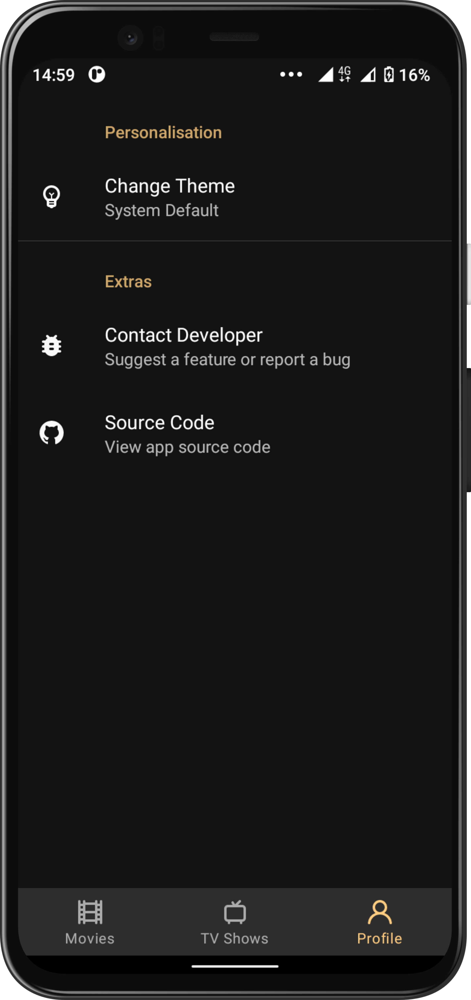

# Kyosk-Interview

An android app built using Kotlin that consumes [IMDB API](https://developer.imdb.com) to display current trending, upcoming and popular movies🍿 and tvshows🎬. It has been built following Clean Architecture Principle, Repository Pattern, MVVM Architecture in the presentation layer as well as Jetpack components.

> Download the apk [here](https://drive.google.com/file/d/17gj0Kb-mey6kQlo8sK2MIaKrvJEsdoq8/view?usp=sharing)

## Table Of Content.

- [Prerequisite](#prerequisite)
    - [Disclaimer](##disclaimer)
- [Architecture](#architecture)
    - [What is Clean Architecture](##why-clean-architecture)
    - [Why Clean Architecture](##why-clean-architecture)
    - [Layers](##layers)
        - [Domain](###domain)
        - [Data](###data)
        - [Presentation](###presentation)
- [Tech Stack](#techstack)
    - [Libraries](##libraries)
    - [Extras](##extras)
- [Helpful Resources](#helpful-resources)
- [Screenshots](#screenshots)

## Prerequisite.

In order to be able to build the application you'll need to change the api key in [`gradle.properties`](link_to_gradle.properties_file). First and formost you need to generate your own api key by [creating](https://imdb-api.com/Identity/Account/Manage) an IMDB account and [generating](https://imdb-api.com/api) an api key.


## Disclaimer.
- Complex architectures like the pure clean architecture can also increase code complexity since decoupling your code also means creating lots of data transformations(mappers) and models, that may end up increasing the learning curve of your code to a point where it would be better to use a simpler architecture like MVVM.

- Clean arcitecture has only been used in this repository to showcase my skills and it's not recommended to use clean architecture in a small scale projects such as this one

So let's get started ...

## Architecture.

### What is Clean Architecture?

A well planned architecture is extremely important for an app to scale and all architectures have one common goal- to manage complexity of your app. This isn't something to be worried about in smaller apps however it may prove very useful when working on apps with longer development lifecycle and a bigger team.

Clean architecture was proposed by [Robert C. Martin](https://en.wikipedia.org/wiki/Robert_C._Martin) in 2012 in the [Clean Code Blog](http://blog.cleancoder.com/uncle-bob/2012/08/13/the-clean-architecture.html) and it follow the SOLID principle.

<p align="center"></p>

The circles represent different layers of your app. Note that:

- The center circle is the most abstract, and the outer circle is the most concrete. This is called the [Abstraction Principle](https://en.wikipedia.org/wiki/Abstraction_principle_(computer_programming)). The Abstraction Principle specifies that inner circles should contain business logic, and outer circles should contain implementation details.

- Another principle of Clean Architecture is the [Dependency Inversion](https://en.wikipedia.org/wiki/Dependency_inversion_principle). This rule specifies that each circle can depend only on the nearest inward circle ie. low-level modules do not depend on high-level modules but the other way around.

### Why Clean Architecture?
- Loose coupling between the code - The code can easily be modified without affecting any or a large part of the app's codebase thus easier to scale the application later on.
- Easier to test code.
- Separation of Concern - Different modules have specific responsibilities making it easier for modification and maintenance.

## Layers.

### 1. Domain.
This is the core layer of the application. The ```domain``` layer is independent of any other layers thus ] domain models and business logic can be independent from other layers.This means that changes in other layers will have no effect on domain layer eg.  screen UI (presentation layer) or changing database (data layer) will not result in any code change withing domain layer.

Components of domain layer include:
- __Models__: Defines the core structure of the data that will be used within the application.

- __Repositories__: Interfaces used by the use cases. Implemented in the data layer.

- __Use cases/Interactors__: They enclose a single action, like getting data from a database or posting to a service. They use the repositories to resolve the action they are supposed to do. They usually override the operator “invoke”, so they can be called as a function.

### 2. Data.
The ```data``` layer is responsibile for selecting the proper data source for the domain layer. It contains the implementations of the repositories declared in the domain layer. 

Components of data layer include:
- __Models__

    -__Dto Models__: Defines POJO of network responses.

    -__Entity Models__: Defines the schema of SQLite database.

- __Repositories__: Responsible for exposing data to the domain layer.

- __Mappers__: They perform data transformation between ```domain```, ```dto``` and ```entity``` models.

- __Network__: This is responsible for performing network operations eg. defining API endpoints using [Retrofit](https://square.github.io/retrofit/).

- __Cache__: This is responsible for performing caching operations using [Room](https://developer.android.com/training/data-storage/room).

- __Data Source__:  Responsible for deciding which data source (network or cache) will be used when fetching data.

### 3. Presentation.
The ```presentation``` layer contains components involved in showing information to the user. The main part of this layer are the views(activity and fragments) and viewmodels.

# Tech Stack.
This project uses many of the popular libraries, plugins and tools of the android ecosystem.

## Libraries.

- [Koin](https://github.com/google/hilt) - Dependency Injection library.
- [Jetpack](https://developer.android.com/jetpack)
  -   [Android KTX](https://developer.android.com/kotlin/ktx.html) - Provide concise, idiomatic Kotlin to Jetpack and Android platform APIs.
    - [AndroidX](https://developer.android.com/jetpack/androidx) - Major improvement to the original Android [Support Library](https://developer.android.com/topic/libraries/support-library/index), which is no longer maintained.
    -   [Lifecycle](https://developer.android.com/topic/libraries/architecture/lifecycle) - Perform actions in response to a change in the lifecycle status of another component, such as activities and fragments.
    - [LiveData](https://developer.android.com/topic/libraries/architecture/livedata) - Lifecycle-aware, meaning it respects the lifecycle of other app components, such as activities, fragments, or services.
    -   [ViewModel](https://developer.android.com/topic/libraries/architecture/viewmodel) - Designed to store and manage UI-related data in a lifecycle conscious way. The ViewModel class allows data to survive configuration changes such as screen rotations.
     - [Data Binding](https://developer.android.com/topic/libraries/data-binding/) - Allows you to bind UI components in your layouts to data sources in your app using a declarative format rather than programmatically.
    - [Room](https://developer.android.com/training/data-storage/room) - Provides an abstraction layer over SQLite used for offline data caching.
    - [Navigation Component](https://developer.android.com/guide/navigation/navigation-getting-started)-Component that allows easier implementation of navigation from simple button clicks to more complex patterns.

- [MotionLayout](https://medium.com/google-developers/introduction-to-motionlayout-part-i-29208674b10d) - Helps create and manage beautiful UI animations.
- [Retrofit](https://square.github.io/retrofit/) - Type-safe http client 
and supports coroutines out of the box.  
- [GSON](https://github.com/square/gson) - JSON Parser,used to parse 
requests on the data layer for Entities and understands Kotlin non-nullable 
and default parameters.
- [OkHttp-Logging-Interceptor](https://github.com/square/okhttp/blob/master/okhttp-logging-interceptor/README.md) - Logs HTTP request and response data.
- [Coroutines](https://github.com/Kotlin/kotlinx.coroutines) - Library Support for coroutines.
- [Flow](https://developer.android.com/kotlin/flow) - Flows are built on top of coroutines and can provide multiple values. A flow is conceptually a stream of data that can be computed asynchronously.
- [Timber](https://github.com/JakeWharton/timber)-Library for easier logging.
- [Material Design](https://material.io/develop/android/docs/getting-started/) - Build awesome beautiful UIs.
- [Glide](https://github.com/bumptech/glide)- Image Library from loading images from the database and cacheing in memory.
- [kotlinx.coroutines](https://github.com/Kotlin/kotlinx.coroutines) - Library Support for coroutines,provides runBlocking coroutine builder used in tests.
- [Truth](https://truth.dev/) - Assertions Library,provides readability as far as assertions are concerned.
- [Mockito](https://site.mockito.org/) - Mocking framework for tests.
- [Robolectric](http://robolectric.org/) - Framework used to quickly and reliably run unit tests quick using the JVM.

## Extras
- [GitHub Actions](https://github.com/VictorKabata/Notflix/actions) - GitHub actions is used in this project to check for syntax correctness using linting, execute the unit tests, generate a new package and deploying the apk using [Firebase App Distribution](https://firebase.google.com/docs/app-distribution) when pushing changes to the dev branch or when making a pull request to the main branch.

# Helpful Resources
In this section i've included some resources ie. articles and GitHub reposirtories that are helpful when learning about clean architecture:

1. [The clean code blog](https://blog.cleancoder.com/uncle-bob/2012/08/13/the-clean-architecture.html) by Robert C. Martin.
2. [A detailed guide on developing android apps using clean architecture pattern](https://medium.com/@dmilicic/a-detailed-guide-on-developing-android-apps-using-the-clean-architecture-pattern-d38d71e94029) Medium article.
3. [Clean Architecture Component Boilerplater](https://github.com/bufferapp/clean-architecture-components-boilerplate) GitHub repo .
4. [The Force](https://github.com/odaridavid/Clean-MVVM-ArchComponents) GitHub repo by [David Odari](https://twitter.com/_davidodari) demonstrating using clean architecture pattern  
5. [Clean architecture tutorial for android](https://www.raywenderlich.com/3595916-clean-architecture-tutorial-for-android-getting-started) article by Raywenderlich which is really beginner friendly.

# Screenshots
These are the app's screenshots:

 

  

  


 
